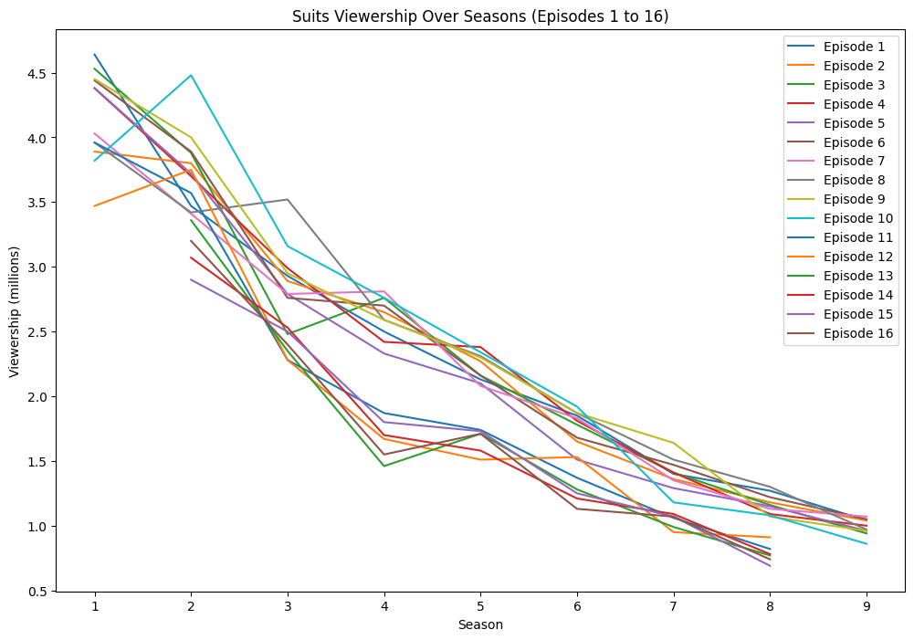

*Suits* is an American television drama series created by Aaron Korsh, which premiered on June 23, 2011, on the USA Network. It revolves around Mike Ross (Patrick J. Adams), who begins working as a law associate for Harvey Specter (Gabriel Macht), despite never attending law school. The show focuses on Harvey and Mike managing to close cases, while maintaining Mike's secret.

The series was renewed for an eighth season on January 30, 2018.[1] In January 2019, the series was renewed for a ninth and final season which premiered on July 17, 2019.[2] During the course of the series, 134 episodes of Suits aired over nine seasons, between June 23, 2011, and September 25, 2019.

## Viewership Statistics
Viewership peaked in Season 1, starting at 4.64 million and ending with a drop in later episodes.

The most significant decline in viewership happened between Seasons 1 and 2, where the show went from 4.45 million to 3.72 million on average.

By the final season, viewership had decreased by over 3 million viewers per episode from the first season.

## A Graph of Viewership Over Time

## Changes in Viewership
The viewership shows a significant decline over time. Between Seasons 1 and 2, the viewership dropped from 4.64 million in Episode 1 to 3.47 million in Season 2, Episode 1 (a decrease of 1.17 million viewers). Later, between Season 5 and Season 6, the viewership dropped again from 2.16 million in Episode 16 of Season 5 to 1.85 million in Episode 1 of Season 6.

## Conclusion
Over the course of 9 seasons, *Suits* saw a steady decline in viewership, likely due to the show's age and the changing interests of its audience.
